> ## 08.07.2020  
> ### 09:10  
> I looked for a good weather map to use as an > overlay for my app, but I did not find any api that worked as I wanted it to.  
> Some of these APIs did not even work on their demo website.  
> Vane is an example of such an API:  
> 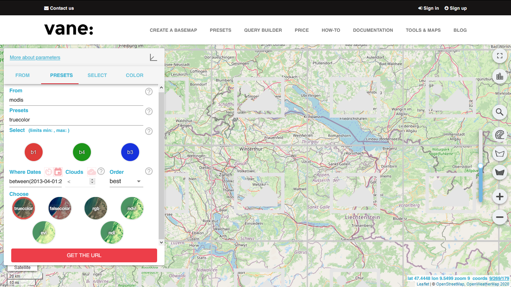  
> 
> ---  
> ### 10:20  
> I looked through some of the other weather APIs and one thing that stuck out to me was how much personal information these companies want.  
> Trimble would be a great example for that.  
> This API wants your full name, the name of your company, your job title, your email and your phone number.  
> There is no way to test it without handing them half of your CV.  
>   
> 
> ---  
> ### 13:45  
> I've finally found a contestant for a weather API.  
> This one is called Windy and it's pretty straight forward.  
> 1. Get an API key  
> 2. Add the library to your HTML body  
> 3. Add the method to your code  
> 4. Hope that it works the first time  
> 
> *It did not work the first time*  
>   
---  
---  
> ## 09.07.2020  
> ### 13:20  
> I finally managed to make the area filters work on the map.  
> For example can I color all golf courses whatever color I'd like.  
> But I can not only mark golf courses.  
> I found a list of all the things that can be marked.  
>   
> 
> ---  
> ### 15:05  
> I wrote some code to make it easier to specify what you want to be marked.  
> Now such a layer can easily be marked by adding it to the layers array in map.service.ts.  
> As an example, say this is your configuration:  
> ```
> layers: { id: string, color: string }[] = [  
>   { id: "landuse.golf", color: "#5555FF" },  
>   { id: "water", color: "#FFAAAA" },  
>   { id: "landuse.forest", color: "#00AA00" }  
> ];
> ```  
> This would produce this result:  
>   
> 
> ---  
> ### 17:05  
> I tested the marking functionality until now, so I can make sure it'll work in the end product.  
---  
---  
> ## 10.07.2020  
> ### 13:00
> I found a goldmine on opendata.swiss.  
> Everything that's related to parking in the Zurich has a dataset.  
> This is also the reason, why I did not write this earlier, since I was bombarded with data.  
> I hope I can figure out how to implement that into my app.  
>> 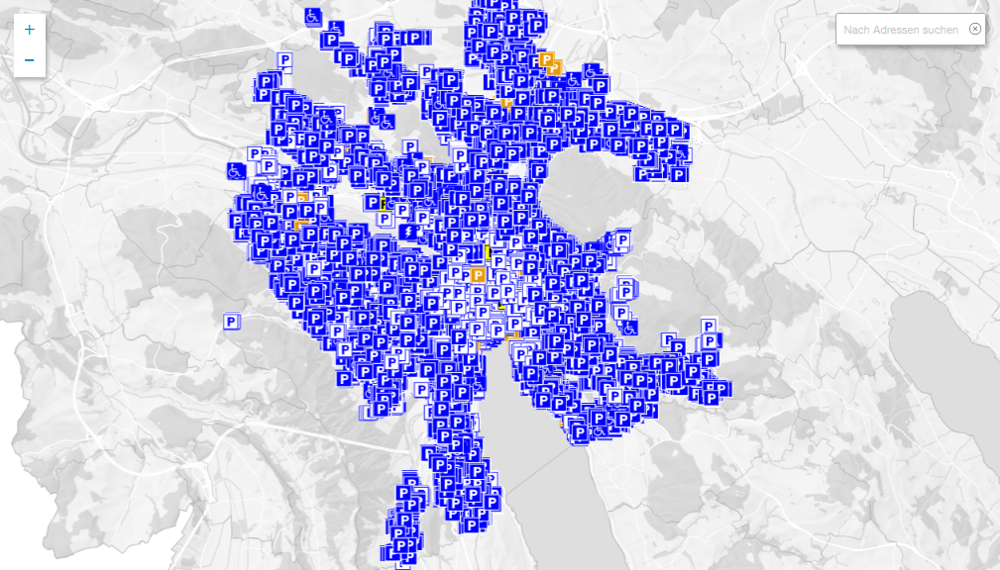  
>> All parking lots for cars  
>
>> 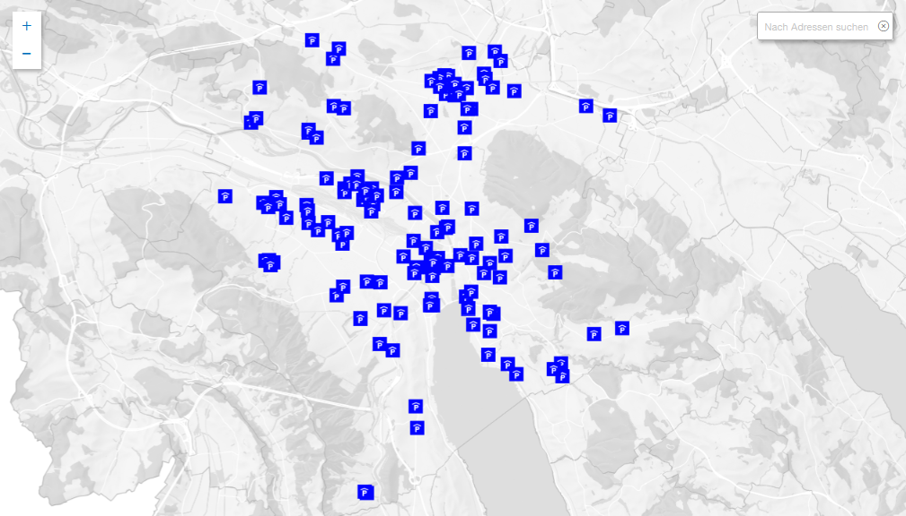
>> All parkhouses  
>
>> 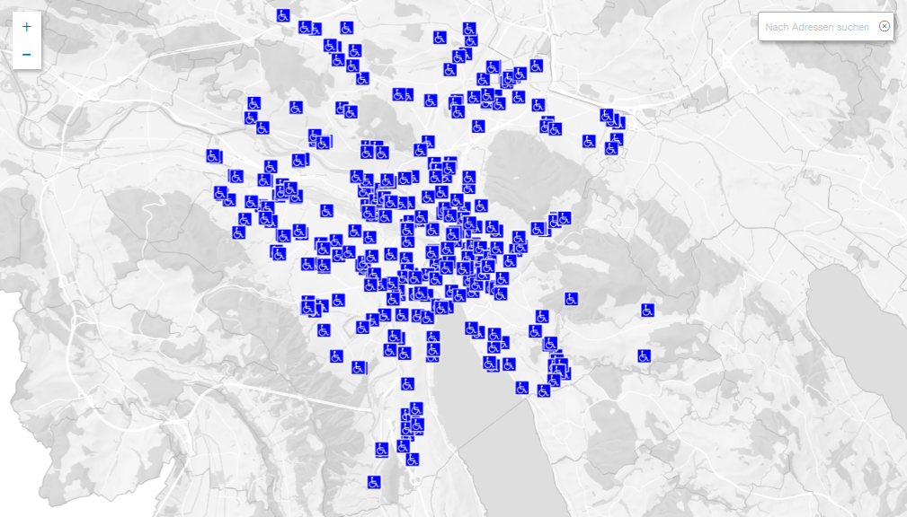  
>> All parking lots for the disabled  
>
>> 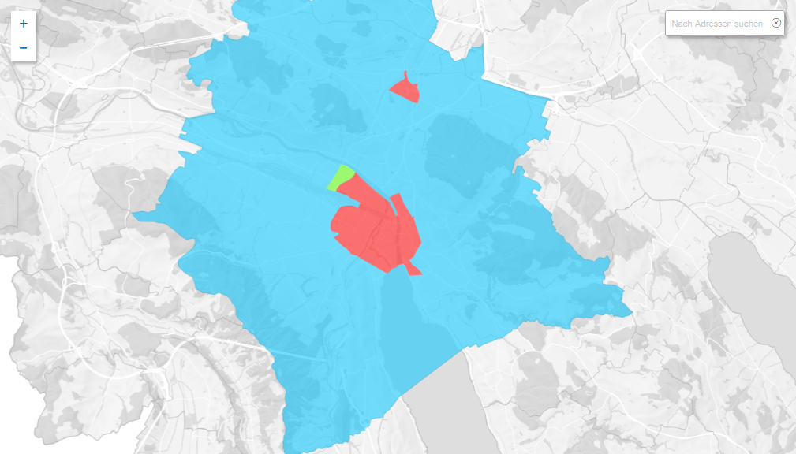  
>> All parking zones  
>
>> 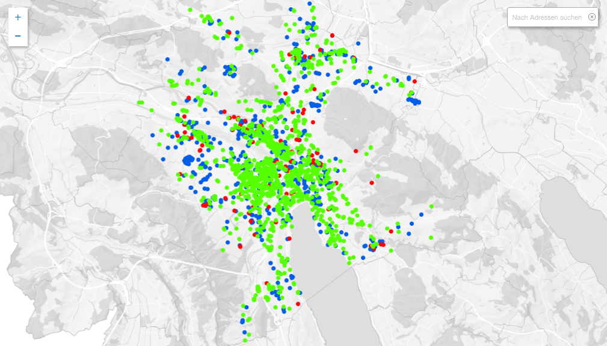  
>> All parking spaces for two-wheelers  
> 
> ---  
> ### 14:20
> I've found a dataset of all the zones in Switzerland, where you're not allowed to fly drones.  
> I thought this might also be of use to some people, since the fine you have to pay, if you accidentally fly into a no-fly zone are pretty hefty.  
> 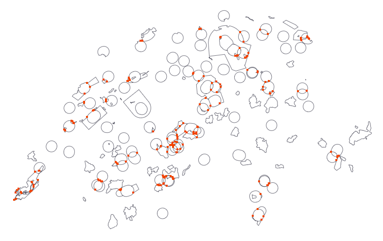  
>
> ---  
> ### 17:30  
> I managed to implement some rather chunky methods, which make it very easy to import such datasets.  
> I've tested it on the dataset of all parking lots for the disabled.  
> 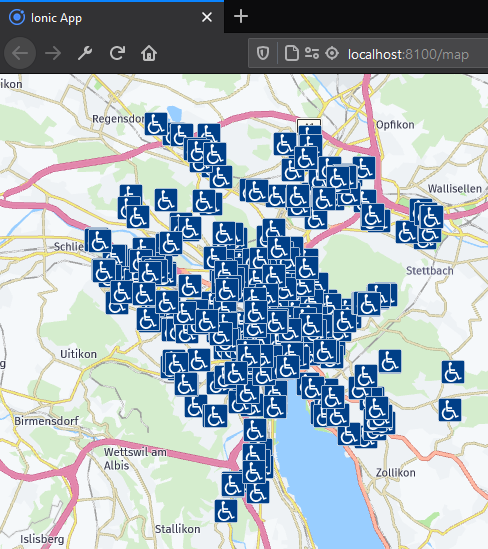  
---  
---  
> ## 14.07.2020  
> ### 14:00  
> I wrote a few functions, to make the import easier and more dynamic, but it's loading all the markers at once, which blue screened my laptop. I did lose quite a lot of my progress, but I did not lose my patience.
> 
> ---  
> ### 17:15
> I finished rebuilding what I've lost today, but there is still a problem with a dataset.  
> The parking lot dataset has thousands of entries, and it's still being loaded at the same time.  
> But it's too late now to fix it today, so I guess this will be tomorrow's challenge.  
>> Here is a screenshot, of how the app looks so far:  
>> 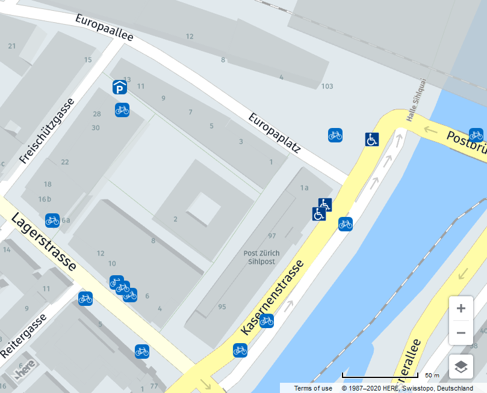  
>  
>> Here are the icons that I designed today (except for the disabled icon):  
>>   
>>   
>>   
>>   
---  
---  
> ## 17.07.2020 
> ### 12:45 
> Found a better way to read out geoJSON files, using the HERE Maps API.
> This method probably is able to read it much more efficiently than my own method.
>
> ---
> ### 17:10
> I managed to implement the native method of the API to read the data.
> I am not able to use the read out data yet, since it doesn't return the same type.
---
---
> ## 20.07.2020
> ### 11:45
> I'm clicking through the documentation for the geoJSON reader from the HERE API, to find a method, that may fit with what I need to make the markers on the map load faster.
> I have tried a few approaches, but nothing has worked so far.
>
> ---
> ### 17:30
> I found a method called:
> ```typescript
> .getParsedObjects(): H.map.Object[]
> ```
> This method returns all map objects parsed via the geoJSON reader.  
> Using this, I'm able to access the coordinates of all the parsed markers.  
---  
---  
> ## 21.07.2020  
> ### 12:30  
> I found a way to get the coordinates of the corners of the visible map.  
> This way I can filter out all the markers, that don't need to be visible/loaded.  
> Using this, the program does not have to render all 49'000+ parking lots.  
> Instead it only renders the ~200 lots, that are visible on screen, which makes the loading times around 60 times faster.  
>> Here is the map loaded with the visible parking lots  
>>   
>>  
>> Here the map zoomed out, to show, that only the important ones are loaded  
>> 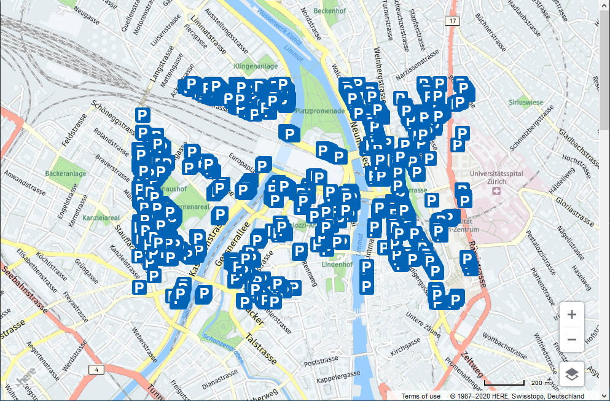  
---  
---  
> ## 22.07.2020  
> ### 13:00  
> Updated the documentation to what the project is now.  
> Added much more to the stock analysis.  
> 
> ---  
> ### 18:00  
> Managed to make the rendering of the markers dynamic, so that it always loads the ones, that are currently visible.  
> I had to export some code into separate functions, in order to improve efficiency.  
> I also commented some of the functions, so it's easier to understand.  
>> Here is an animated GIF, showing the dynamic loading  
>>   
---  
---  
> ## 24.07.2020  
> ### 11:45  
> I tried to make an icon for the app, but I'm not quite sure if I like it.  
> I also made a gantt chart for the forseeable future.  
>> Here is the icon  
>>   
>  
>> Here is a screenshot of the chart  
>> 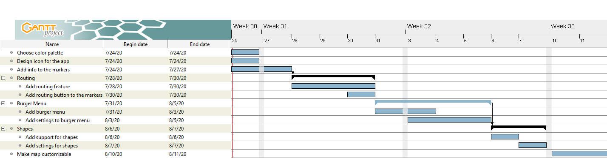