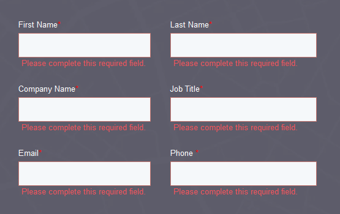
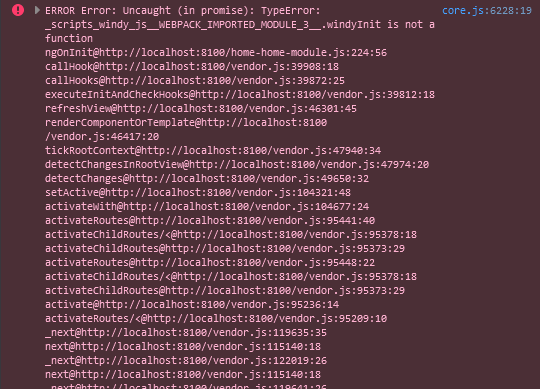
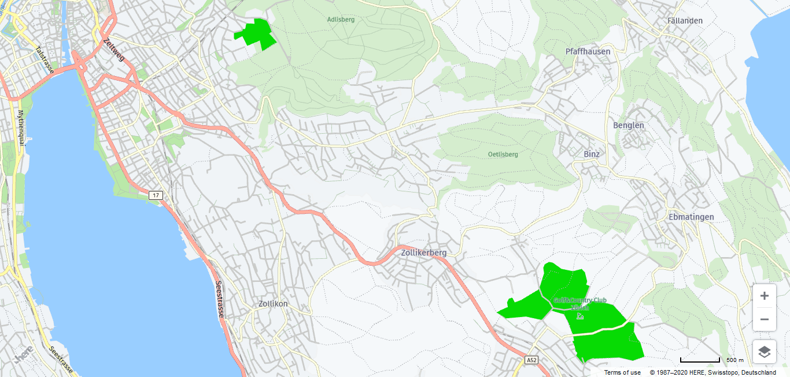
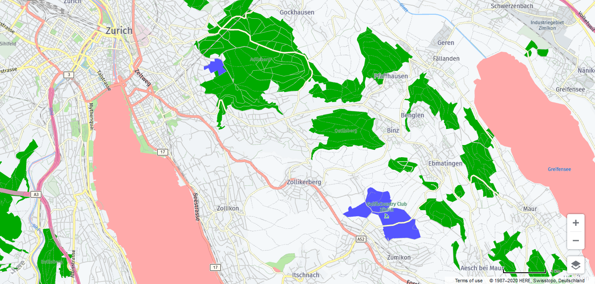

## 08.07.2020  
### 09:10  

### 10:20  
I looked through some of the other weather APIs and one thing that stuck out to me was how much personal information these companies want.  
Trimble would be a great example for that.  
This API wants your full name, the name of your company, your job title, your email and your phone number.  
There is no way to test it without handing them half of your CV.  
  
---  
### 13:45  
I've finally found a contestant for a weather API.  
This one is called Windy and it's pretty straight forward.  
1. Get an API key  
2. Add the library to your HTML body  
3. Add the method to your code  
4. Hope that it works the first time  
*It did not work the first time*  
  
---  
---  
## 09.07.2020  
### 13:20  
I finally managed to make the area filters work on the map.  
For example can I color all golf courses whatever color I'd like.  
But I can not only mark golf courses.  
I found a list of all the things that can be marked.  
  
---  
### 15:05  
I wrote some code to make it easier to specify what you want to be marked.  
Now such a layer can easily be marked by adding it to the layers array in map.service.ts.  
As an example, say this is your configuration:  
```
layers: { id: string, color: string }[] = [  
  { id: "landuse.golf", color: "#5555FF" },  
  { id: "water", color: "#FFAAAA" },  
  { id: "landuse.forest", color: "#00AA00" }  
];
```  
This would produce this result:  

